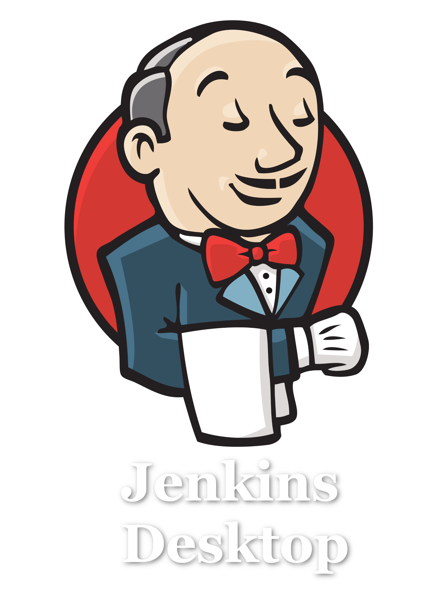

# Jenkins Desktop

### A desktop wrapper for Jenkins. 

---

Stack : Wails + Vue + TS. 
The Go backend spawns the system `jenkins` command on startup, owns the process, and kills it when the
app closes. The frontend shows a splash screen while Jenkins boots, then hands
the window over to the Jenkins web UI at `http://localhost:8080`.

Requirements: the `jenkins` command must be on your `PATH`
(e.g. `brew install jenkins`).

Optional env vars:

- `JENKINS_COMMAND` — binary to run (default `jenkins`)
- `JENKINS_PORT` — HTTP port (default `8080`)
- `JENKINS_ARGS` — extra args appended to the command

If Jenkins is already running on the port when the app starts, the app
attaches to it instead of spawning a new instance (and won't kill it on exit).

## Live Development

To run in live development mode, run `wails dev` in the project directory. This will run a Vite development
server that will provide very fast hot reload of your frontend changes. If you want to develop in a browser
and have access to your Go methods, there is also a dev server that runs on http://localhost:34115. Connect
to this in your browser, and you can call your Go code from devtools.

## Building

To build a redistributable, production mode package, use `wails build`.

Note: on newer Xcode versions the link needs an extra framework, so build
with `CGO_LDFLAGS="-framework UniformTypeIdentifiers" wails build`.
