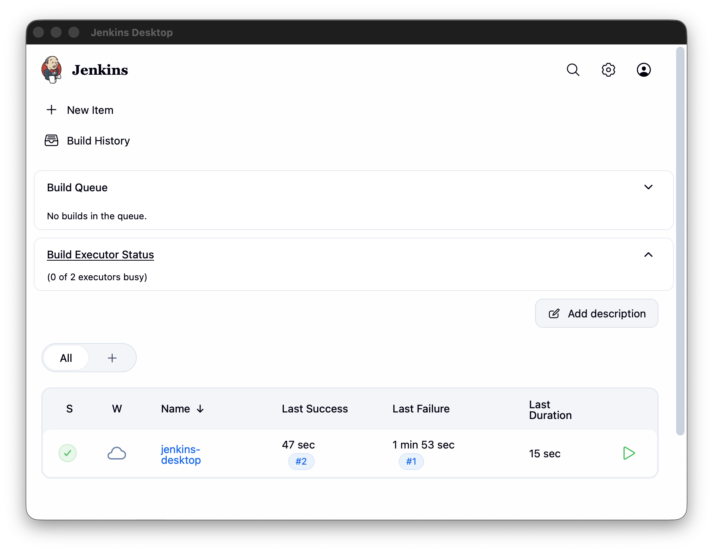

#  Jenkins Desktop

---

A desktop wrapper for Jenkins. The app launches the system `jenkins` command, owns the process, and displays the Jenkins web UI in a native window — no browser tab required.

## How it behaves

- **If Jenkins isn't running**, the app starts it, shows a splash screen while it boots, then hands the window over to Jenkins at `http://localhost:8080`.
- **If Jenkins is already running**, the app attaches to it instead of starting a second copy.
- **When you close the app**, it stops the Jenkins process it started. A Jenkins you started yourself is left alone.

For long builds, the recommended setup is to run Jenkins independently (e.g. `brew services start jenkins`) and let the app attach to it — that way closing the window can never interrupt a build. See [Getting Started](getting-started.md).

## Contents

- **Getting Started**
    - [Installation](getting-started.md) — install, first launch, daily use
    - [Building from Source](building.md) — dev mode and packaging the `.app`
    - [How It Works](how-it-works.md) — backend lifecycle and frontend handoff
- **Configuration**
    - [Options & Ports](configuration.md) — environment variables and ports
    - [Troubleshooting](troubleshooting.md) — common problems and fixes
- **Project**
    - [Contributing](contributing.md) — conventions, roadmap, current needs

> **Compatibility:** built and tested on macOS with the Homebrew Jenkins installation. The Go code also compiles for Windows, but there is usually no `jenkins` command on `PATH` there — see [Configuration](configuration.md#windows-notes).
